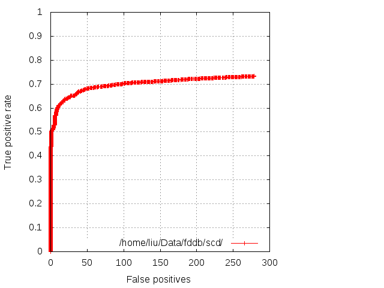
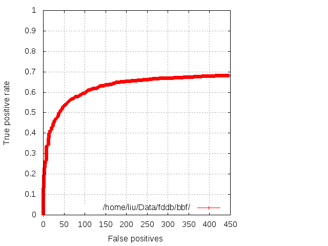
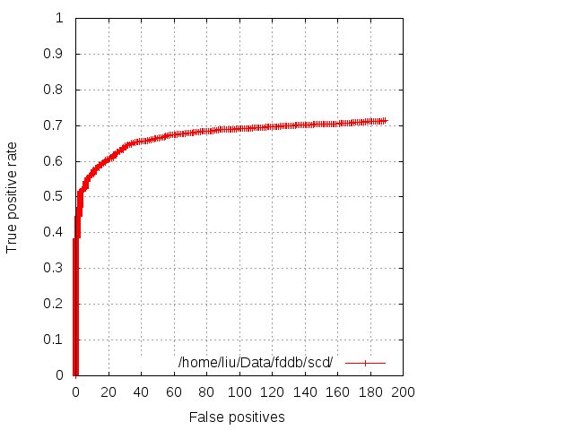

SCD: SURF-Cascade Detection
===========================

What's SCD?
-----------

The paper refers to: Learning SURF Cascade for Fast and Accurate Object Detection, Jianguo Li,
Yimin Zhang, CVPR 2013

This implementation is heavily modified, most notably, this implementation uses vanilla SURF
feature rather than the T2 feature proposed in the paper. This implementation also supports
color images.

How it works?
-------------

	> cd ./bin > ./scddetect <Your Image contains Faces> ../samples/face.sqlite3 | ./bbfdraw.rb <Your Image contains Faces> output.png > open output.png

What about the performance?
---------------------------

The tests are performed with FDDB dataset (http://vis-www.cs.umass.edu/fddb/)

After the dataset is downloaded and unzipped
(http://vis-www.cs.umass.edu/fddb/index.html#download).  The evaluation tools are downloaded,
unzipped, and compiled (http://vis-www.cs.umass.edu/fddb/results.html).

I mainly compared this implementation with the state of the art frontal face detector
implementations and the BBF implementation as is. `scdfmt.rb` script is provided to convert
rectangle format from BBF or SCD to ellipse format which seems provide a better result on
FDDB dataset.

Use the following command to convert the file list from FDDB with `.jpg` suffix:

	> sed 's/$/.jpg/' <directory to FDDB folds>/FDDB-fold-01.txt > FDDB-fold-01-jpg.txt

The following command will generate outputs that evaluation script understands:

	> ./scddetect FDDB-fold-01-jpg.txt ../samples/face.sqlite3 <directory to actual image> | ./scdfmt.rb > <directory to output where evaluation script wants>/fold-01-out.txt

After all 10 folds completed, run:

	> ./runEvaluate.pl

Please make sure the evaluation mode is ellipse format.

The following graph will likely to be generated:

The threshold is tuned to generate about 200~300 false positives.

The BBF implementation can be evaluated too:

	> ./bbfdetect FDDB-fold-01-jpg.txt ../samples/face <directory to actual image> | ./scdfmt.rb > <directory to output where evaluation script wants>/fold-01-out.txt

The generated graph:

You can compare the performance with the state of the art face detectors on FDDB website, at
about 250 false positives, this implementation at 72.93% is 4.23% shorter than the best frontal
face detector (SURF-Cascade Frontal, 77.16% detection rate). At around same false positives,
OpenCV's frontal face implemenation is at 45.18% detection rate, and the BBF implementation is
at 66.27% detection rate with the same false positives.

What about the speed?
---------------------

One reason why BBF implementation, despite its rather unimpressive accuracy, still provided in
ccv is its speed. At the longest time, BBF implementation or more accurately, its derivative is
the only one that can run semi-real time on modern JavaScript engines. Although there is no plan
to port SCD implemenation to JavaScript, its native code performance is only twice as slow as BBF
(OpenCV is about 3 times slower than BBF with single thread setup), thus, showing promising sign
will eventually be on par or faster, and finally replace BBF implementation. This performance
requires to run `./scddetect` with default parameters (the parameters for FDDB run from 24x24
size, whereas the default parameters run from 48x48 size), and operating with grayscale images
(load image with `CCV_IO_GRAY | CCV_IO_ANY_FILE` parameter).

	> ./scddetect addams-family.png ../samples/face.sqlite3 total : 7 in time 381ms
	> ./bbfdetect addams-family.png ../samples/face total : 7 in time 182ms

With these parameters, we are obviously incurring some penalties elsewhere.  At 190 false
positives, SCD with 48x48 template and grayscale images has 71.41% detection rate, where as SCD
with 24x24 template and color image has 72.11% detection rate. The BBF implementation has 65.11%
detection rate at the same false positives.

How to train my own detector?
-----------------------------

The vision community in the past a few years has generated plenty of open dataset,
therefore, it is now possible to train a reasonable face detector (as shown by
[HeadHunter](https://bitbucket.org/rodrigob/doppia)) with open dataset.

This face detector is trained on AFLW dataset: http://lrs.icg.tugraz.at/research/aflw/

A script `./aflw` is provided to generate positive images from AFLW annotated original photos. But
first, we need to generate a list of photos => faces rectangles.

AFLW dataset provided a SQLite file, therefore:

	> sqlite3 aflw.sqlite
	sqlite> .output outrect.txt
	sqlite> .mode tabs
	sqlite> SELECT filepath, x, y, w, h, roll, pitch, yaw FROM FaceImages, Faces, FacePose, FaceRect WHERE FaceImages.file_id = Faces.file_id AND Faces.face_id = FacePose.face_id AND Faces.face_id = FaceRect.face_id;
	sqlite> .exit

Now, run `./aflw` to generate the positive examples:

	> ./aflw outrect.txt <directory to AFLW dataset>/data/flickr/ <output directory>

It will take a while to complete, but once it is done, you will see 16444 images in the output
directory, both in grayscale and color.

Using `find` command to create both list of negative images for hard mining, and the list
of positives:

	> find <output directory for positive images> -name '*.png' > facepos.txt
	> find <negative images collected from web> -name '*.jpg' > faceneg.txt

Training with `scdcreate` is full automatic, run:

	> ./scdcreate --positive-list facepos.txt --background-list faceneg.txt --working-dir face.sqlite3 --negative-count 16444

It takes me about half day to finish training to 6-th classifier, and this is the depth used
in ./samples/face.sqlite3.

